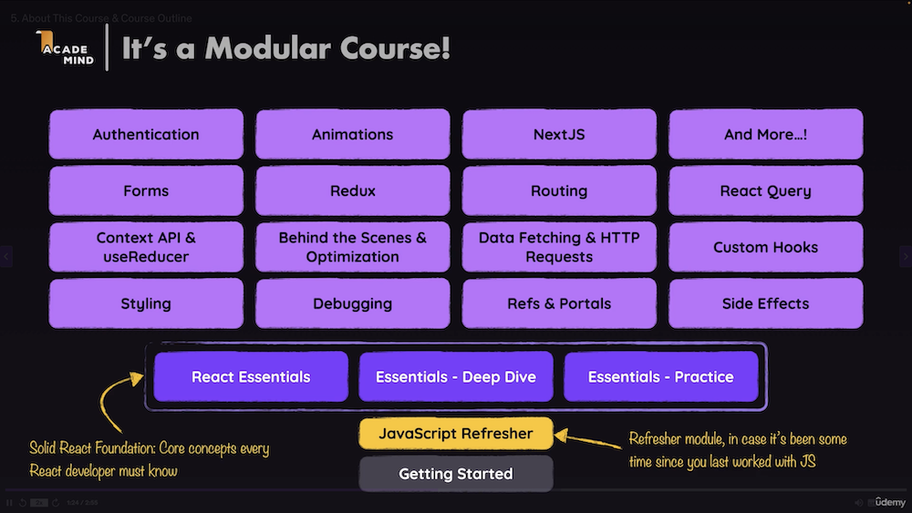

<link href="./style.css" rel="stylesheet" />

# Courses To Take (In This Order)

All of these courses are taken from the full library below. Before starting a new course I should make sure that this is the actual course that I want to take from this subject group and should also probably double check that there are not any other or new courses on this subject that might be better than the one I plan to take.

## Courses:

1. [React - The Complete Guide 2024 (incl. Next.js, Redux)](https://www.udemy.com/course/react-the-complete-guide-incl-redux/learn) - _(71.5 hrs)_ - Maximilian Schwarzmüller
2. [React Testing with Jest / Vitest - TypeScript - 2025](https://www.udemy.com/course/typescript-with-react-jest-testing/learn) - _(5 hrs)_ - Alex Dan
3. [React & TypeScript - The Practical Guide](https://www.udemy.com/course/react-typescript-the-practical-guide/learn) - _(7.5 hrs)_ - Maximilian Schwarzmüller
4. [AI For Developers With GitHub Copilot, Cursor AI & ChatGPT](https://www.udemy.com/course/ai-for-developers-with-github-copilot-cursor-ai-chatgpt/learn) - _(5.5 hrs)_ - Maximilian Schwarzmüller
5. [Clean Code](https://www.udemy.com/course/writing-clean-code/learn) - _(6.5 hrs)_ - Maximilian Schwarzmüller
6. [NodeJS - The Complete Guide (MVC, REST APIs, GraphQL, Deno)](https://www.udemy.com/course/nodejs-the-complete-guide/learn) - _(40.5 hrs)_ - Maximilian Schwarzmüller
   - maybe additional backend courses here (e.g. database)
7. [The Complete Full-Stack Web Development Bootcamp](https://www.udemy.com/course/the-complete-web-development-bootcamp/learn) - _(61.5 hrs)_ - Dr. Angela Yu
8. [React with Test Driven Development](https://www.udemy.com/course/react-with-test-driven-development/learn) - _(15 hrs)_ - Basar Buyukkahraman

---

### React

**_Current Boomi - Player Tracker - General Knowledge - Good to Review_**

#### [React - The Complete Guide 2024 (incl. Next.js, Redux)](https://www.udemy.com/course/react-the-complete-guide-incl-redux/learn) - _(71.5 hrs)_ - Maximilian Schwarzmüller

- **VIDEOS THAT WOULD BE GOOD TO REVIEW:** _the rest of the videos can safely be ignored_

  - any module summary or introduction
  - review these notes [JavaScript Dev Notes](../dev-notes/javascript.md)
  - Section 4: React Essentials - Deep Dive
    - [Splitting Components (vids 63 - 64)](https://www.udemy.com/course/react-the-complete-guide-incl-redux/learn/lecture/39659746#overview)
    - [Forwarding Props (vids 65 - 66)](https://www.udemy.com/course/react-the-complete-guide-incl-redux/learn/lecture/39659750#overview)
    - [Multiple JSX Slots (vid 67)](https://www.udemy.com/course/react-the-complete-guide-incl-redux/learn/lecture/39659754#overview)
    - [Setting Component Types Dynamically (vid 68)](https://www.udemy.com/course/react-the-complete-guide-incl-redux/learn/lecture/39659756#overview)
    - [**Prefer Computed Values & Identifying Unnecessary State (vids 84 - 91)**](https://www.udemy.com/course/react-the-complete-guide-incl-redux/learn/lecture/39659808#overview)
    - [Why Immutability Matters - Always! (vid 93)](https://www.udemy.com/course/react-the-complete-guide-incl-redux/learn/lecture/39659844#overview)
    - [When NOT to Lift State Up (vid 94)](https://www.udemy.com/course/react-the-complete-guide-incl-redux/learn/lecture/39659846#overview)
  - Section 7: Debugging React Apps
    - [Using Browser Debugger & Breakpoints (vid 128)](https://www.udemy.com/course/react-the-complete-guide-incl-redux/learn/lecture/39836188#overview)
  - Section 8: Working with Refs & Portals
    - [Exposing Component APIs via the **_useImperativeHandle_** Hook (vid 142)](https://www.udemy.com/course/react-the-complete-guide-incl-redux/learn/lecture/39836376#overview)
    - [Introducing & Understanding "Portals" (vid 147)](https://www.udemy.com/course/react-the-complete-guide-incl-redux/learn/lecture/39836418#overview)
  - Section 10: React's Context API & useReducer - Advanced State Management
    - [Using Context (vids 168 - 170 & 174)](https://www.udemy.com/course/react-the-complete-guide-incl-redux/learn/lecture/8246374#overview)
    - [Using `useReducer` for State Management (vids 175 - 176)](https://www.udemy.com/course/react-the-complete-guide-incl-redux/learn/lecture/8244660#overview)
  - Section 11: Handling Side Effects and Working with the useEffect() Hook
    - [Object & Function Dependencies and the useCallback Hook (vids 189 - 190)](https://www.udemy.com/course/react-the-complete-guide-incl-redux/learn/lecture/8244658#overview)
  - Section 12: Practice Project: Building a Quiz App
    - this entire section would be a good one to review at 2x speed. Don't bother building the entire app again, but there are some good tidbits regarding `useRef` and `useCallback` and JS timers `setTimeout` and `setInterval`, etc.
  - Section 13: A Look Behind The Scenes Of React & Optimization Techniques
    - another entire section to review good explainations of `memo`, `useCallback` and `useMemo`
  - Section 15: Sending Http Requests (e.g. Connecting to a Database)
    - [Handling HTTP Errors (vid 237)](https://google.com) - This video has a good practical example of using a `try...catch` block
    - [Using Optimistic Updating (vid 241)](https://www.udemy.com/course/react-the-complete-guide-incl-redux/learn/lecture/39836976#questions)
  - Section 16: Building Custom React Hooks
    - another section to fully review at 2x, especially focusing on:
    - [Custom Hook: Managing State & Returning State Values (vid 247)](https://www.udemy.com/course/react-the-complete-guide-incl-redux/learn/lecture/39837058#overview)
  - Section 17: Working with Forms & User Input
    - another good section to possibly review at 2x - lots of small tips and tricks for working with forms.

#### Other Courses

- [Server Side Rendering with React and Redux](https://www.udemy.com/course/server-side-rendering-with-react-and-redux/learn) - _(8.5 hrs)_ - Stephen Grider
- [Advanced React and Redux](https://www.udemy.com/course/react-redux-tutorial/learn) - _(21 hrs)_ - Stephen Grider
- [Modern React with Redux [2024 Update]](https://www.udemy.com/course/react-redux/learn) - _(75.5 hrs)_ - Stephen Grider

---

### AI Tools

**_Current Boomi - Player Tracker - General Knowledge_**

- [The Ultimate Guide To ChatGPT & Midjourney](https://www.udemy.com/course/the-ultimate-guide-to-chatgpt-midjourney-prompt-engineering-openai-gpt/learn) - _(11.5 hrs)_ - Colt Steele
- [AI For Developers With GitHub Copilot, Cursor AI & ChatGPT](https://www.udemy.com/course/ai-for-developers-with-github-copilot-cursor-ai-chatgpt/learn) - _(5.5 hrs)_ - Maximilian Schwarzmüller
- [GitHub Copilot Beginner to Pro - AI for Coding & Development](https://www.udemy.com/course/github-copilot/learn) - _(7 hrs)_ - Tom Phillips

---

### Testing

**_Current Boomi - Player Tracker - General Knowledge_**

- [React Testing with Jest / Vitest - TypeScript - 2025](https://www.udemy.com/course/typescript-with-react-jest-testing/learn) - _(5 hrs)_ - Alex Dan
- [Unit Testing for Typescript & NodeJs Developers with Jest](https://www.udemy.com/course/unit-testing-typescript-nodejs/learn/lecture/22720621#overview) - _(11.5 hrs)_ - Alex Dan
- [React Testing Library and Jest: The Complete Guide](https://www.udemy.com/course/react-testing-library-and-jest/learn) - _(7.5 hrs)_ - Stephen Grider
- [Cypress End-to-End Testing - Getting Started](https://www.udemy.com/course/cypress-end-to-end-testing-getting-started/learn) - _(6 hrs)_ - Maximilian Schwarzmüller
- [JavaScript Unit Testing - The Practical Guide](https://www.udemy.com/course/javascript-unit-testing-the-practical-guide/learn) - _(5.5 hrs)_ - Maximilian Schwarzmüller
- [Testing Next.js Apps with Jest, Testing Library and Cypress](https://www.udemy.com/course/nextjs-testing/learn) - _(8 hrs)_ - Bonnie Schulkin
- [React Testing Library with Jest / Vitest](https://www.udemy.com/course/react-testing-library/learn) - _(7.5 hrs)_ - Bonnie Schulkin

---

### TypeScript

**_Current Boomi - Player Tracker - General Knowledge_**

- [Mastering TypeScript - 2024 Edition](https://www.udemy.com/course/learn-typescript/learn) - _(11 hrs)_ - Colt Steele
- [React and Typescript: Build a Portfolio Project](https://www.udemy.com/course/react-and-typescript-build-a-portfolio-project/learn) - _(29.5 hrs)_ - Stephen Grider
- [Typescript: The Complete Developer's Guide](https://www.udemy.com/course/typescript-the-complete-developers-guide/learn) - _(27.5 hrs)_ - Stephen Grider
- [React & TypeScript - The Practical Guide](https://www.udemy.com/course/react-typescript-the-practical-guide/learn) - _(7.5 hrs)_ - Maximilian Schwarzmüller
- [Understanding TypeScript](https://www.udemy.com/course/understanding-typescript/learn) - _(22.5 hrs)_ - Maximilian Schwarzmüller

---

### TDD - Test Driven Development

**_Current Boomi - Player Tracker - General Knowledge_**

- [React with Test Driven Development](https://www.udemy.com/course/react-with-test-driven-development/learn) - _(15 hrs)_ - Basar Buyukkahraman
- [React - Mastering Test Driven Development](https://www.udemy.com/course/react-tdd/learn) - _(4.5 hrs)_ - David Joseph Katz

---

### Node

**_Current Boomi - Player Tracker - General Knowledge_**

- [Node js with Test Driven Development](https://www.udemy.com/course/test-driven-development-with-nodejs/learn) - _(22 hrs)_ - Basar Buyukkahraman
- [Node with React: Fullstack Web Development](https://www.udemy.com/course/node-with-react-fullstack-web-development/learn) - _(25.5 hrs)_ - Stephen Grider
- [NodeJS - The Complete Guide (MVC, REST APIs, GraphQL, Deno)](https://www.udemy.com/course/nodejs-the-complete-guide/learn) - _(40.5 hrs)_ - Maximilian Schwarzmüller

---

### Databases / Query Languages

**_Current Boomi - Player Tracker - General Knowledge_**

- [SQL and PostgreSQL: The Complete Developer's Guide](https://www.udemy.com/course/sql-and-postgresql/learn) - _(22 hrs)_ - Stephen Grider
- [GraphQL with React: The Complete Developers Guide](https://www.udemy.com/course/graphql-with-react-course/learn) - _(13.5 hrs)_ - Stephen Grider
- [The Complete Developers Guide to MongoDB](https://www.udemy.com/course/the-complete-developers-guide-to-mongodb/learn) - _(13 hrs)_ - Stephen Grider
- [SQL - The Complete Developer's Guide (MySQL, PostgreSQL)](https://www.udemy.com/course/sql-the-complete-developers-guide-mysql-postgresql/learn) - _(19.5 hrs)_ - Maximilian Schwarzmüller
- [MongoDB - The Complete Developer's Guide 2024](https://www.udemy.com/course/mongodb-the-complete-developers-guide/learn) - _(17.5 hrs)_ - Maximilian Schwarzmüller

---

### CI-CD / Dev Ops / Infrastructure

**_Current Boomi - Player Tracker - General Knowledge_**

- [AWS Certified Cloud Practitioner CLF-C02](https://www.udemy.com/course/aws-cloud-practitioner-complete-aws-introduction/learn) - _(12.5 hrs)_ - Maximilian Schwarzmüller
- [GitHub Actions - The Complete Guide](https://www.udemy.com/course/github-actions-the-complete-guide/learn) - _(10.5 hrs)_ - Maximilian Schwarzmüller
- [The DevOps Essentials - The Handbook](https://www.udemy.com/course/the-devops-essentials/learn) - _(2 hrs)_ - Anand Rao Nednur
- [Introduction to Devops - Learn DevOps basics in 3 hours!](https://www.udemy.com/course/devopscrash/learn) - _(3 hrs)_ - Rick Crisci
- [DevOps Beginners to Advanced with Projects](https://www.udemy.com/course/decodingdevops/learn) - _(53.5 hrs)_ - Imran Teli
- [Docker & Kubernetes: The Practical Guide (2024 Edition)](https://www.udemy.com/course/docker-kubernetes-the-practical-guide/learn) - _(23.5 hrs)_ - Maximilian Schwarzmüller
- [AWS Serverless APIs & Apps - A Complete Introduction](https://www.udemy.com/course/aws-serverless-a-complete-introduction/learn) - _(8 hrs)_ - Maximilian Schwarzmüller

---

### Version Control

**_Good to Review_**

- [The Git & Github Bootcamp](https://www.udemy.com/course/git-and-github-bootcamp/learn) - _(17 hrs)_ - Colt Steele
- [Git & GitHub - The Practical Guide](https://www.udemy.com/course/git-github-practical-guide/learn) - _(10.5 hrs)_ - Maximilian Schwarzmüller

---

### Full Stack

**_Player Tracker - General Knowledge - Good to Review_**

- [The Complete Full-Stack Web Development Bootcamp](https://www.udemy.com/course/the-complete-web-development-bootcamp/learn) - _(61.5 hrs)_ - Dr. Angela Yu
- [React, NodeJS, Express & MongoDB - The MERN Fullstack Guide](https://www.udemy.com/course/react-nodejs-express-mongodb-the-mern-fullstack-guide/learn) - _(19 hrs)_ - Maximilian Schwarzmüller

---

### JavaScript

**_Good to Review_**

- [The Modern Javascript Bootcamp Course](https://www.udemy.com/course/javascript-beginners-complete-tutorial/learn) - _(52 hrs)_ - Colt Steele & Stephen Grider
- [ES6 Javascript: The Complete Developer's Guide](https://www.udemy.com/course/javascript-es6-tutorial/learn) - _(6.5 hrs)_ - Stephen Grider
- [JavaScript - The Complete Guide 2024 (Beginner + Advanced)](https://www.udemy.com/course/javascript-the-complete-guide-2020-beginner-advanced/learn) - _(52.5 hrs)_ - Maximilian Schwarzmüller
- [Accelerated ES6 JavaScript Training](https://www.udemy.com/course/es6-bootcamp-next-generation-javascript/learn) - _(6 hrs)_ - Maximilian Schwarzmüller
- [The Complete JavaScript Course 2025: From Zero to Expert!](https://www.udemy.com/course/the-complete-javascript-course/learn) - _(71 hrs)_ - Jonas Schmedtmann

---

### Next

**_General Knowledge - Good to Review_**

- [Next JS: The Complete Developer's Guide](https://www.udemy.com/course/next-js-the-complete-developers-guide/learn) - _(15.5 hrs)_ - Stephen Grider
- [Next.js 15 & React - The Complete Guide](https://www.udemy.com/course/nextjs-react-the-complete-guide/learn) - _(40.5 hrs)_ - Maximilian Schwarzmüller
- [Next JS & WordPress: Build rapid NextJS sites with Next & WP](https://www.udemy.com/course/next-js-wordpress/learn) - _(8.5 hrs)_ - Tom Phillips

---

### Web Dev

**_Good to Review_**

- [The Web Developer Bootcamp 2024](https://www.udemy.com/course/the-web-developer-bootcamp/learn) - _(74 hrs)_ - Colt Steele
- [100 Days Of Code - 2025 Web Development Bootcamp](https://www.udemy.com/course/100-days-of-code-web-development-bootcamp/learn) - _(79.5 hrs)_ - Maximilian Schwarzmüller

---

### Other / Misc

**_Current Boomi - Player Tracker - General Knowledge - Good to Review_**

- [Clean Code](https://www.udemy.com/course/writing-clean-code/learn) _(6.5 hrs)_ - Maximilian Schwarzmüller
- [The Linux Command Line Bootcamp: Beginner To Power User](https://www.udemy.com/course/the-linux-command-line-bootcamp/learn) _(16 hrs)_ - Colt Steele
- [Software Engineering 101: Plan and Execute Better Software.](https://www.udemy.com/course/software-engineering-101/learn) _(8.5 hrs)_ - Kurt Anderson
- [The Bootstrap 4 Bootcamp](https://www.udemy.com/course/bootstrap-4-bootcamp/learn) _(11.5 hrs)_ - Colt Steele
- [JavaScript Algorithms and Data Structures Masterclass](https://www.udemy.com/course/js-algorithms-and-data-structures-masterclass/learn) _(22 hrs)_ - Colt Steele
- [Webpack 2: The Complete Developer's Guide](https://www.udemy.com/course/webpack-2-the-complete-developers-guide/learn) _(5.5 hrs)_ - Stephen Grider
- [CSS - The Complete Guide 2024 (incl. Flexbox, Grid & Sass)](https://www.udemy.com/course/css-the-complete-guide-incl-flexbox-grid-sass/learn) _(23 hrs)_ - Maximilian Schwarzmüller
- [Java Programming for Complete Beginners](https://www.udemy.com/course/java-programming-tutorial-for-beginners/learn) _(59 hrs)_ - in28Minutes Official

#### Section Tags:

- Current Boomi project
- USMNT Player Tracker project
- General computing knowledge that would be helpful at work
- Good to review
